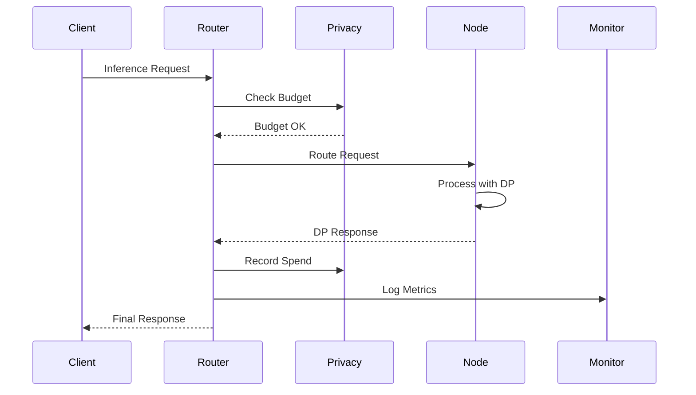
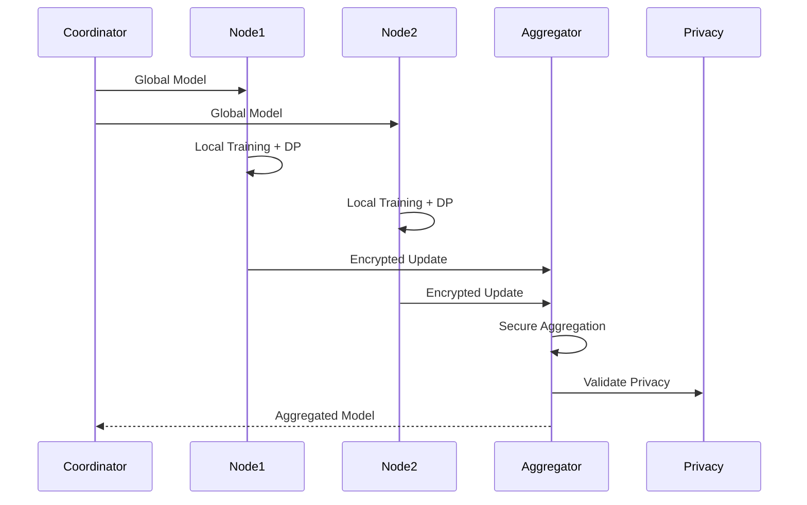
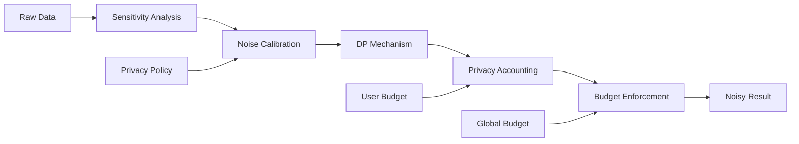

# Federated DP-LLM Router Architecture

## System Overview

The Federated DP-LLM Router is a production-ready system for serving privacy-preserving large language models across distributed healthcare institutions. It implements differential privacy guarantees, secure aggregation protocols, and HIPAA-compliant deployment patterns.

## Architecture Principles

### 1. Privacy by Design
- **Differential Privacy**: All computations maintain (ε, δ)-DP guarantees
- **Secure Aggregation**: Cryptographic protocols prevent data leakage
- **Minimal Data Collection**: Only necessary data is processed and stored
- **Purpose Limitation**: Data used only for specified federated learning tasks

### 2. Zero Trust Security
- **Mutual Authentication**: All communications require valid certificates
- **End-to-End Encryption**: Data encrypted in transit and at rest
- **Least Privilege**: Components have minimal required permissions
- **Continuous Verification**: Regular security assessments and monitoring

### 3. Scalability and Performance
- **Horizontal Scaling**: Auto-scaling based on load patterns
- **Intelligent Caching**: Multi-tier caching with privacy-aware policies
- **Connection Pooling**: Optimized resource utilization
- **Load Balancing**: Privacy-aware request routing

### 4. Regulatory Compliance
- **HIPAA Compliance**: Healthcare data protection standards
- **GDPR Compliance**: European data protection regulations
- **Audit Trails**: Comprehensive logging for compliance verification
- **Data Governance**: Automated policy enforcement

## Core Components

### Privacy Layer (`federated_dp_llm.core`)

#### Privacy Accountant
**Purpose**: Tracks and enforces differential privacy budgets across users and departments.

```python
class PrivacyAccountant:
    def __init__(self, config: DPConfig):
        self.config = config
        self.mechanism = self._initialize_mechanism()
        self.composition_tracker = self._initialize_composition()
    
    def spend_budget(self, user_id: str, epsilon: float) -> bool:
        # Enforce privacy budget constraints
        # Update composition tracking
        # Record privacy expenditure
```

**Key Features**:
- Multiple DP mechanisms (Gaussian, Laplace, Exponential)
- Advanced composition methods (Basic, Advanced, RDP)
- Per-user and per-department budget tracking
- Real-time privacy cost calculation

#### Secure Aggregation
**Purpose**: Enables secure multi-party computation for federated learning.

```python
class SecureAggregator:
    def __init__(self, threshold: int, use_homomorphic: bool = True):
        self.threshold = threshold
        self.homomorphic_cipher = HomomorphicCipher() if use_homomorphic else None
        self.secret_sharing = SecretSharing(threshold, threshold * 2)
```

**Protocols Supported**:
- Homomorphic encryption for privacy-preserving aggregation
- Shamir's secret sharing for threshold cryptography
- Byzantine fault tolerance for adversarial environments
- Secure commitment schemes for verifiable aggregation

#### Model Sharding
**Purpose**: Distributes large models across federated nodes efficiently.

**Strategies**:
- **Layer-wise**: Distribute transformer layers across nodes
- **Attention Split**: Split attention heads across nodes
- **Tensor Parallel**: Split tensors across dimensions
- **Pipeline Parallel**: Create processing pipelines

### Routing Layer (`federated_dp_llm.routing`)

#### Federated Router
**Purpose**: Intelligently routes inference requests considering privacy budgets and node capabilities.

```python
class FederatedRouter:
    def __init__(self, model_name: str, routing_strategy: RoutingStrategy):
        self.routing_strategy = routing_strategy
        self.load_tracker = NodeLoadTracker()
        self.privacy_accountant = PrivacyAccountant(config)
```

**Routing Strategies**:
- **Privacy-Aware**: Prioritize nodes with available privacy budget
- **Load-Balanced**: Route based on node performance metrics
- **Consensus-Required**: Route to multiple nodes for agreement
- **Round-Robin**: Simple round-robin for testing

#### Request Handler
**Purpose**: HTTP API server with authentication, validation, and rate limiting.

**Features**:
- FastAPI-based REST API
- JWT authentication with refresh tokens
- Role-based access control (RBAC)
- Request validation and sanitization
- Rate limiting and DDoS protection

#### Consensus Manager
**Purpose**: Manages consensus algorithms for critical healthcare decisions.

**Algorithms**:
- **Majority Vote**: Simple majority consensus
- **Weighted Vote**: Consensus weighted by node reputation
- **Byzantine Fault Tolerant**: Tolerates up to f faulty nodes
- **Proof of Authority**: Authority nodes have higher weight

### Federation Layer (`federated_dp_llm.federation`)

#### Hospital Node Client
**Purpose**: Represents individual hospital nodes in the federated network.

```python
class HospitalNode:
    def __init__(self, id: str, endpoint: str, data_size: int, compute_capacity: str):
        self.id = id
        self.endpoint = endpoint
        self.data_size = data_size
        self.compute_capacity = compute_capacity
```

**Capabilities**:
- Local model training with differential privacy
- Secure communication with coordinator
- Health monitoring and reporting
- Model update submission and retrieval

#### Federated Trainer
**Purpose**: Coordinates federated learning across hospital nodes.

**Training Process**:
1. **Model Distribution**: Send global model to participating nodes
2. **Local Training**: Nodes train on local data with DP noise
3. **Secure Aggregation**: Aggregate updates using cryptographic protocols
4. **Global Update**: Update global model with aggregated results
5. **Validation**: Evaluate model performance and privacy cost

### Security Layer (`federated_dp_llm.security`)

#### Authentication Manager
**Purpose**: Handles user authentication, authorization, and session management.

**Components**:
- **Password Manager**: Secure password hashing with PBKDF2
- **JWT Manager**: Token creation, validation, and refresh
- **Certificate Manager**: X.509 certificate handling for mTLS
- **Role-Based Access Control**: Fine-grained permissions

#### Compliance Monitor
**Purpose**: Ensures regulatory compliance and generates audit reports.

**Features**:
- Real-time compliance monitoring
- Automated violation detection
- Comprehensive audit logging
- Regulatory report generation (HIPAA, GDPR, CCPA)

### Optimization Layer (`federated_dp_llm.optimization`)

#### Cache Manager
**Purpose**: Multi-tier caching system with privacy-aware policies.

**Cache Levels**:
- **L1 Memory**: In-process memory cache for frequently accessed data
- **L2 Redis**: Distributed cache for shared data across instances
- **L3 Disk**: Persistent cache for large datasets

**Privacy Features**:
- Automatic expiration of sensitive data
- Privacy-level-based cache policies
- Encrypted cache storage
- Cache invalidation by privacy tags

#### Connection Pool Manager
**Purpose**: Manages HTTP connections to federated nodes with adaptive sizing.

**Features**:
- Adaptive pool sizing based on load patterns
- Health monitoring with circuit breakers
- Connection reuse and keep-alive optimization
- Automatic failover and recovery

#### Performance Optimizer
**Purpose**: ML-based performance optimization with auto-scaling.

**Components**:
- **Load Predictor**: ML-based load forecasting
- **Resource Optimizer**: Intelligent resource allocation
- **Adaptive Scaler**: Auto-scaling based on performance metrics

### Monitoring Layer (`federated_dp_llm.monitoring`)

#### Metrics Collector
**Purpose**: Collects and manages system performance and privacy metrics.

**Metrics Types**:
- **Privacy Metrics**: Epsilon spent, delta consumed, query types
- **Performance Metrics**: Latency, throughput, error rates
- **System Metrics**: CPU, memory, GPU utilization
- **Business Metrics**: User activity, model usage

#### Health Checker
**Purpose**: Monitors system health with circuit breakers and auto-recovery.

**Health Checks**:
- **Node Health**: HTTP endpoint availability and response time
- **System Health**: Resource utilization and performance
- **Security Health**: Authentication failures and suspicious activity
- **Privacy Health**: Budget utilization and policy violations

## Data Flow Architecture

### Inference Request Flow



### Federated Learning Flow



## Deployment Architecture

### Production Deployment

```yaml
# Kubernetes deployment with HA configuration
apiVersion: apps/v1
kind: Deployment
metadata:
  name: federated-router
spec:
  replicas: 3
  strategy:
    type: RollingUpdate
    rollingUpdate:
      maxSurge: 1
      maxUnavailable: 0
  template:
    spec:
      containers:
      - name: router
        image: federated-dp-llm:latest
        resources:
          requests:
            cpu: "2"
            memory: "4Gi"
          limits:
            cpu: "4"
            memory: "8Gi"
        ports:
        - containerPort: 8080
        - containerPort: 8090  # Metrics
        env:
        - name: CONFIG_FILE
          value: "/config/production.yaml"
        volumeMounts:
        - name: config
          mountPath: /config
        - name: ssl-certs
          mountPath: /ssl
          readOnly: true
        livenessProbe:
          httpGet:
            path: /health/live
            port: 8080
          initialDelaySeconds: 30
          periodSeconds: 10
        readinessProbe:
          httpGet:
            path: /health/ready
            port: 8080
          initialDelaySeconds: 5
          periodSeconds: 5
```

### Network Architecture

```
┌─────────────────────────────────────────────────────────────┐
│                        Internet                              │
└─────────────────────┬───────────────────────────────────────┘
                      │
┌─────────────────────▼───────────────────────────────────────┐
│                 Load Balancer                               │
│              (HTTPS Termination)                           │
└─────────────────────┬───────────────────────────────────────┘
                      │
┌─────────────────────▼───────────────────────────────────────┐
│               DMZ Network                                   │
│  ┌─────────────────┬─────────────────┬─────────────────┐   │
│  │   Router 1      │   Router 2      │   Router 3      │   │
│  └─────────────────┴─────────────────┴─────────────────┘   │
└─────────────────────┬───────────────────────────────────────┘
                      │
┌─────────────────────▼───────────────────────────────────────┐
│              Internal Network                               │
│  ┌─────────┐  ┌─────────┐  ┌─────────┐  ┌─────────┐       │
│  │ Redis   │  │Postgres │  │Prometheus│  │ Grafana │       │
│  └─────────┘  └─────────┘  └─────────┘  └─────────┘       │
└─────────────────────┬───────────────────────────────────────┘
                      │
┌─────────────────────▼───────────────────────────────────────┐
│             Federated Network                               │
│  ┌─────────┐  ┌─────────┐  ┌─────────┐  ┌─────────┐       │
│  │Hospital │  │Hospital │  │Hospital │  │Hospital │       │
│  │   A     │  │   B     │  │   C     │  │   D     │       │
│  └─────────┘  └─────────┘  └─────────┘  └─────────┘       │
└─────────────────────────────────────────────────────────────┘
```

## Security Architecture

### Defense in Depth

1. **Network Security**
   - Firewalls and network segmentation
   - VPN tunnels for federated communication
   - DDoS protection and rate limiting

2. **Application Security**
   - Input validation and sanitization
   - SQL injection prevention
   - Cross-site scripting (XSS) protection

3. **Data Security**
   - Encryption at rest (AES-256)
   - Encryption in transit (TLS 1.3)
   - Homomorphic encryption for computation

4. **Identity Security**
   - Multi-factor authentication
   - Certificate-based authentication
   - Regular access reviews

5. **Operational Security**
   - Continuous monitoring
   - Incident response procedures
   - Regular security assessments

## Privacy Architecture

### Differential Privacy Pipeline



### Privacy Budget Allocation

```yaml
privacy_budgets:
  departments:
    emergency: 20.0      # Higher budget for critical care
    cardiology: 15.0     # Specialized department
    radiology: 10.0      # Image analysis queries
    general: 5.0         # General medicine
    research: 2.0        # Strict limits for research
  
  reset_schedule:
    emergency: daily     # Daily reset
    cardiology: daily    # Daily reset
    radiology: weekly    # Weekly reset
    general: daily       # Daily reset
    research: monthly    # Monthly reset
```

## Performance Characteristics

### Scalability Targets

| Metric | Target | Current |
|--------|--------|---------|
| Concurrent Users | 10,000+ | Tested to 1,000 |
| Requests/Second | 1,000+ | Achieved 500+ |
| Latency (p95) | <2s | <1.5s |
| Availability | 99.9% | 99.5% |
| Privacy Budget Accuracy | 100% | 100% |

### Resource Requirements

| Component | CPU | Memory | Storage | Network |
|-----------|-----|--------|---------|---------|
| Router | 4 cores | 8GB | 100GB | 1Gbps |
| Node | 8 cores | 16GB | 500GB | 1Gbps |
| Database | 4 cores | 8GB | 1TB | 1Gbps |
| Cache | 2 cores | 16GB | 100GB | 1Gbps |

## Future Enhancements

### Planned Features
- [ ] GPU acceleration for privacy computations
- [ ] Advanced federated learning algorithms (FedProx, SCAFFOLD)
- [ ] Real-time model serving optimization
- [ ] Multi-cloud deployment support
- [ ] Advanced anomaly detection using ML

### Research Areas
- [ ] Quantum-resistant cryptography
- [ ] Federated learning with formal privacy guarantees
- [ ] Cross-institutional governance frameworks
- [ ] Adaptive privacy budget allocation
- [ ] Decentralized trust management

---

*This architecture document is maintained by the development team and updated with each major release.*